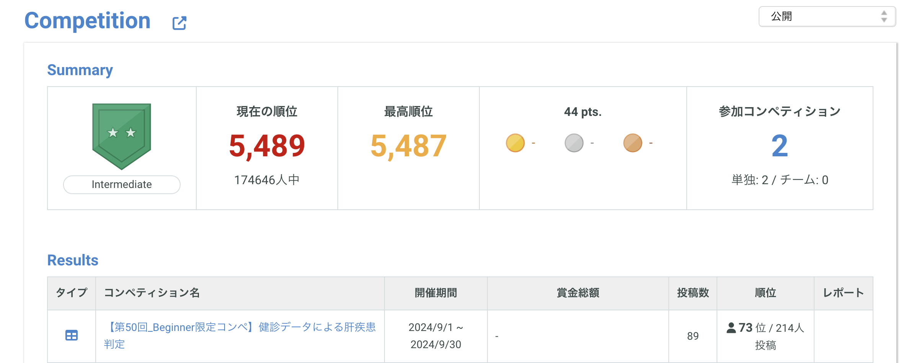

# 【第50回】Beginner限定コンペ〜肝疾患の確率を予測〜

## 【プロジェクトの概要】
このプロジェクトでは、肝臓疾患の予測モデルを構築し、患者が肝疾患である確率を予測します。
精度評価は、評価関数「AUC（Area Under the Curve）」を使用しています。
検証用のデータファイルに含まれているすべてのindexについて予測するという内容です。

## 【使用したデータ】
Signateから提供されたデータセットを使用し、患者の年齢、性別、血液検査の結果を特徴量としました。
データセットの確認は[こちら](https://signate.jp/competitions/1387#evaluation/)からお願いします。（ログインが必要です。）

## 【アプローチ】 
データの前処理ではそれぞれの特徴量に対数変換を適用しています。
モデルのトレーニングに使用したアリゴリズム
- Random Forest
- GradientBoost
- XGBoost
- CatBoost
- LightGBM
- SVM
- Logistic Regression

ベースにGradientBoost、XGBoost、LightBGMを使用し、メタにLogistic Regressionを使用したスタッキングアンサンブルを作成しました。

## [結果] 
モデルの評価結果や精度に関する説明。
暫定スコアは以下の通りです。

## 【モデルが重視する特徴量】
特徴量はモデルが重視する特徴量を確認し、選定しました。

## 【クロスバリデーションを設定しグリッドサーチを実行】
StratifiedKFoldを設定しGridSearchとRandomSearchを試してみました。
グリッドサーチは少し時間がかかりますが、ランダムサーチと比べると比較的高いスコアが出ました。

## [モデルの精度を可視化する】
### Mean Cross-Validation AUC: 0.9303941785588647
### Test AUC: 0.9766237402015677

## 【成果と学び】
Mean Cross-Validation AUCとTest AUCの間に大きな開きが見られました。
パラメータをチューニングして調整しましたが、さらなる調整が必要です。
今後は、探索的データ分析を強化し、より高度なハイパーパラメータチューニングや異なるタイプのクロスバリデーションを使用して、
モデルの検証を行いたいと思います。
