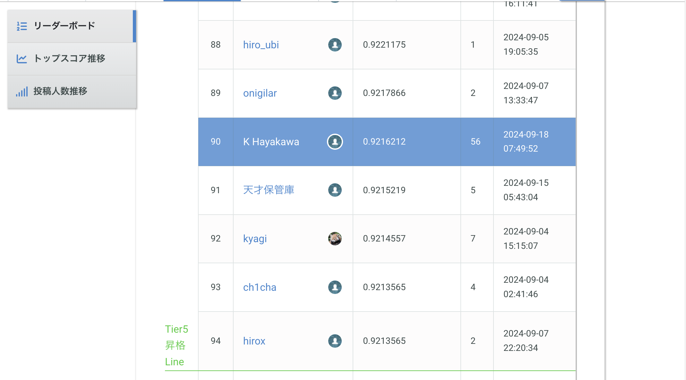
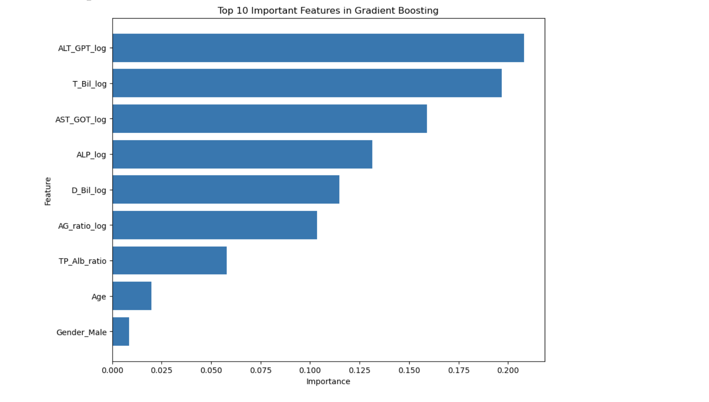
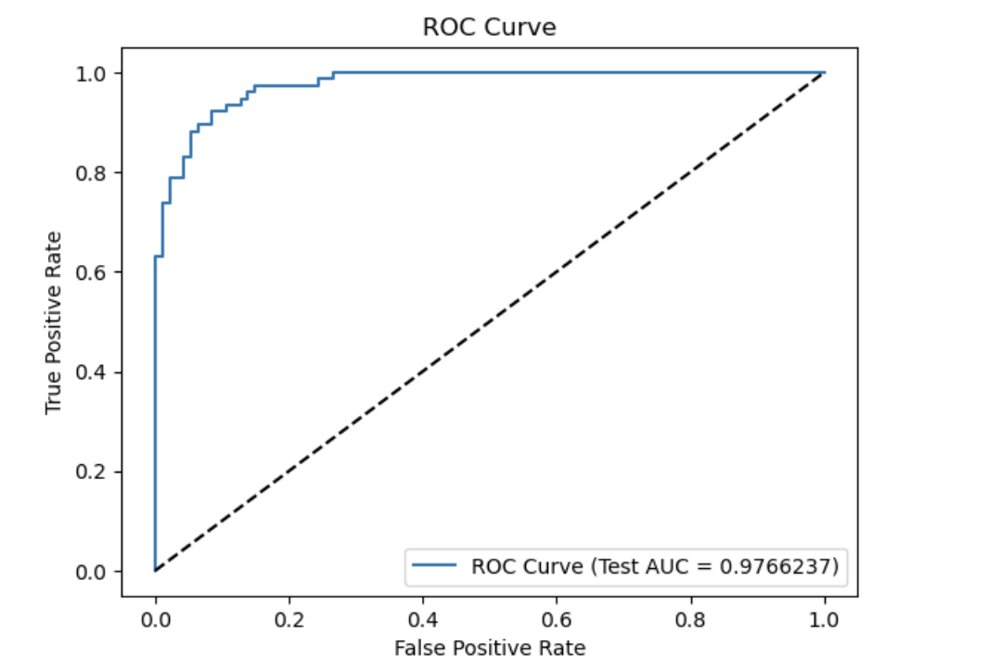

# 第50回_Beginner限定コンペ_肝疾患の確率を予測-

## 【プロジェクトの概要】
このプロジェクトでは、肝臓疾患の予測モデルを構築し、患者が肝疾患である確率を予測します。
精度評価は、評価関数「AUC（Area Under the Curve）」を使用しています。
検証用のデータファイルに含まれる、すべてのindexについて予測するという内容です。

## 【使用したデータ】
Signateから提供されたデータセットを使用し、患者の年齢、性別、血液検査の結果を特徴量としました。
データセットを確認したい方は[こちら](https://signate.jp/competitions/1387#evaluation/)からお願いします。（ログインが必要です。）

## 【アプローチ】 
データの前処理ではそれぞれの特徴量に対数変換を適用しています。
モデルのトレーニングに使用したアリゴリズム
- Random Forest
- GradientBoost
- XGBoost、CatBoost
- LightGBM
- SVM
- Logistic Regression

アンサンブルモデルを作成しましたが、GradientBoostが一番精度が高いという結果になりました。

## [結果] 
モデルの評価結果や精度に関する説明。
暫定スコアは以下の通りです。

## 【モデルが重視する特徴量】

## 【クロスバリデーションを設定しグリッドサーチを実行】
StratifiedKFoldを設定しGridSearchとRandomSearchを試してみました。
グリッドサーチは少し時間がかかりますが、ランダムサーチと比べると比較的高いスコアが出ました。

## [モデルの精度を可視化する】
### Mean Cross-Validation AUC: 0.9303941785588647
### Test AUC: 0.9766237402015677

## 【成果と学び】
トレーニングデータセットのクラスは0が55%、1が45％くらいでクラス不均等なデータセットではありませんでした。
医療データなので、外れ値に該当する数値がありましたが、あえて削除や処理を行わず、対数変換で対応しました。
パラメータのチューニングやランダムステイトの数の違いがモデルの精度に反映します。
今後、より精度の高いモデルを目指し、チューニングに注力したいです。
