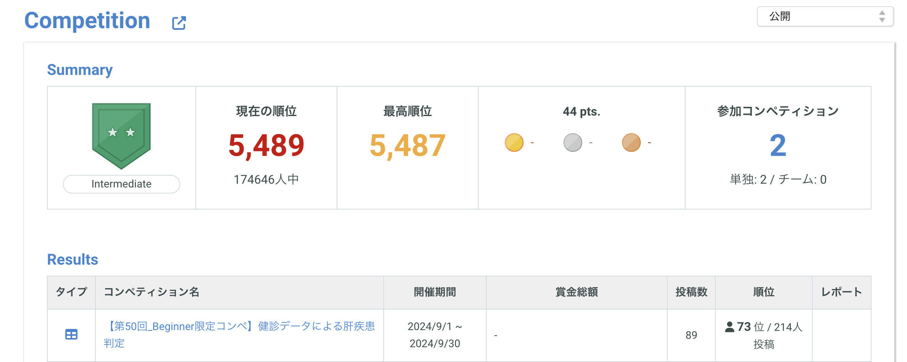

# **【第50回】Beginner限定コンペ〜肝疾患の確率を予測**

健康診断データを活用し、肝疾患の有無を判定するモデルを構築しました。本プロジェクトでは、評価指標AUC（Area Under the Curve）を用いて、精度の高い予測モデルを開発しました。

## **1. プロジェクト概要**

### **テーマ**
健康診断データに基づき、肝疾患の有無を判定するモデルの構築

### **背景**
肝疾患の早期発見は健康リスク軽減や医療費削減に直結します。本プロジェクトでは、検診データから肝疾患リスクを効率的に判定する予測モデルを開発し、医療現場のリスク管理の改善に貢献することを目的としました。

### **目的**
モデルの性能指標であるAUC（Area Under the Curve）を最大化し、肝疾患の有無を高精度で判定する分類モデルを構築すること。

### **成果**
- **最終AUCスコア**: 0.9238710（目標値 0.9212903 を達成）

## **2. データの概要**

### **データセット**
本プロジェクトで使用したデータは、健康診断結果を基に作成された多変量データであり、肝疾患の有無（目的変数）を予測することを目的としています。ただし、データセットはコンペ終了後に公開が停止されています。

### **データ形式**
- **行数**: 学習データ（train.csv）: **未確認**
- **列数**: 特徴量 **10個** + 目的変数 **1個**

### **特徴量の一覧**
以下は学習データに含まれる主要な特徴量とその概要です：

| 特徴量名         | 説明                                          | 型        |
|------------------|---------------------------------------------|-----------|
| `Age`           | 年齢                                         | 数値型    |
| `Gender`        | 性別（Male/Female）                         | カテゴリ型 |
| `T_Bil`         | 総ビリルビン値                              | 数値型    |
| `D_Bil`         | 直接ビリルビン値                            | 数値型    |
| `ALP`           | アルカリホスファターゼ値                    | 数値型    |
| `ALT_GPT`       | アラニンアミノトランスフェラーゼ値           | 数値型    |
| `AST_GOT`       | アスパラギン酸アミノトランスフェラーゼ値     | 数値型    |
| `TP`            | 総タンパク質値                              | 数値型    |
| `Alb`           | アルブミン値                                | 数値型    |
| `AG_ratio`      | アルブミン/グロブリン比                     | 数値型    |
| `disease`       | 肝疾患の有無（目的変数: 0=健康, 1=肝疾患） | 数値型    |

### **目的変数**
- **`disease`**
  - 値: `0`（健康）、`1`（肝疾患）
  - クラスの不均衡の影響を考慮し、モデルの評価にはAUC（Area Under the Curve）を使用しました。

### **欠損値**
本データセットには欠損値は含まれていません。

---

## **3. 前処理の概要**

本プロジェクトでは、データの整合性を保ち、モデルの性能を最大限に引き出すために以下の前処理を実施しました。

### **3.1. 対数変換**
対象の特徴量に対し、値のスケールを調整し、外れ値の影響を軽減するために対数変換を適用しました。以下の特徴量に対数変換を実施しました：
- `T_Bil`（総ビリルビン）
- `D_Bil`（直接ビリルビン）
- `ALP`（アルカリホスファターゼ）
- `ALT_GPT`（アラニンアミノトランスフェラーゼ）
- `AST_GOT`（アスパラギン酸アミノトランスフェラーゼ）
- `TP`（総タンパク質）
- `Alb`（アルブミン）
- `AG_ratio`（アルブミン/グロブリン比）

コード例:
```python
train_data['T_Bil_log'] = np.log1p(train_data['T_Bil'])
train_data['D_Bil_log'] = np.log1p(train_data['D_Bil'])
```


## 【アプローチ】 
データの前処理ではそれぞれの特徴量に対数変換を適用しています。
モデルのトレーニングに使用したアリゴリズム
- Random Forest
- GradientBoost
- XGBoost
- CatBoost
- LightGBM
- SVM
- Logistic Regression

ベースにGradientBoost、XGBoost、LightBGMを使用し、メタにLogistic Regressionを使用したスタッキングアンサンブルを作成しました。

## [結果] 
モデルの評価結果や精度に関する説明。
暫定スコアは以下の通りです。



## 【モデルが重視する特徴量】
特徴量はモデルが重視する特徴量を確認し、選定しました。


## 【クロスバリデーションを設定しグリッドサーチを実行】
StratifiedKFoldを設定しGridSearchとRandomSearchを試してみました。
グリッドサーチは少し時間がかかりますが、ランダムサーチと比べると比較的高いスコアが出ました。

## [モデルの精度を可視化する】
### Mean Cross-Validation AUC: 0.9303941785588647
### Test AUC: 0.9766237402015677


## 【成果と学び】
Mean Cross-Validation AUCとTest AUCの間に大きな開きが見られました。
パラメータをチューニングして調整しましたが、さらなる調整が必要です。
今後は、探索的データ分析を強化し、より高度なハイパーパラメータチューニングや異なるタイプのクロスバリデーションを使用して、
モデルの検証を行いたいと思います。
