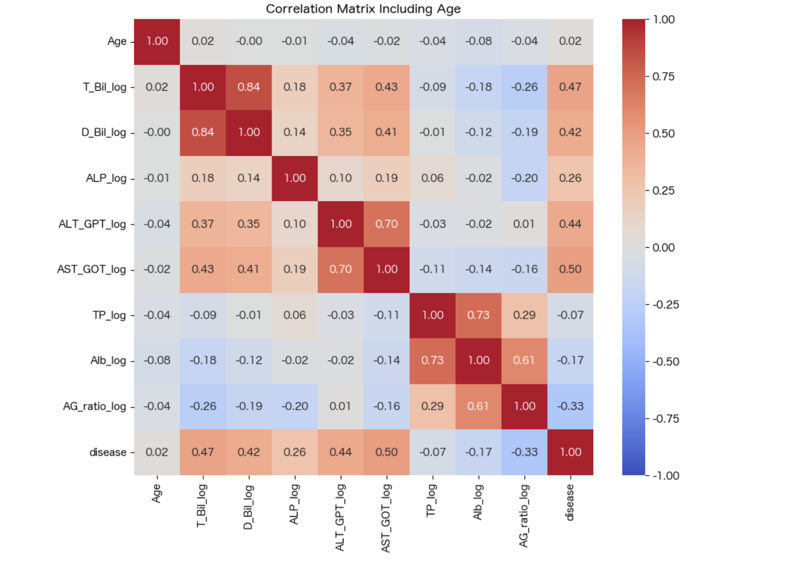
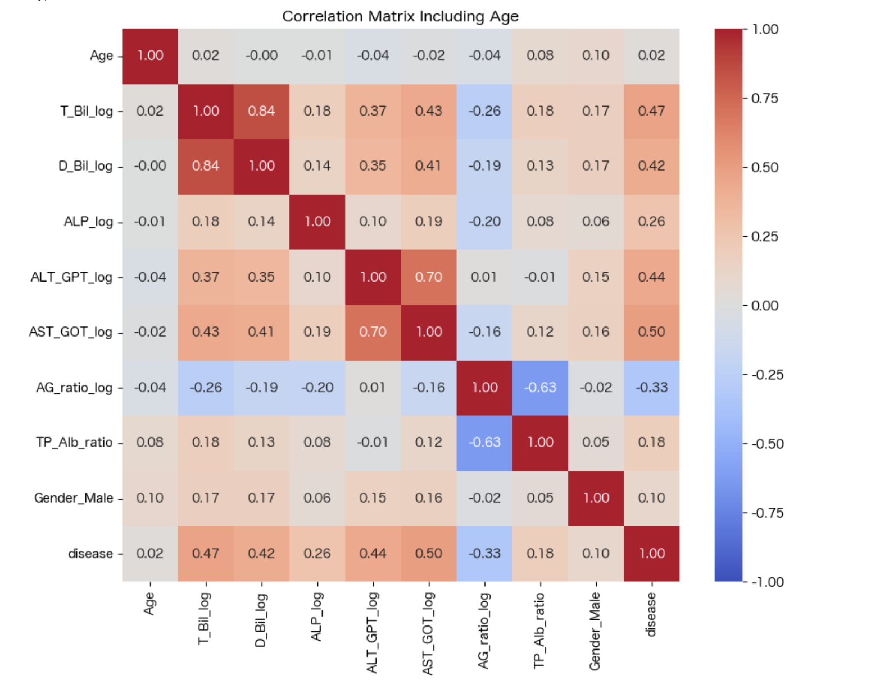
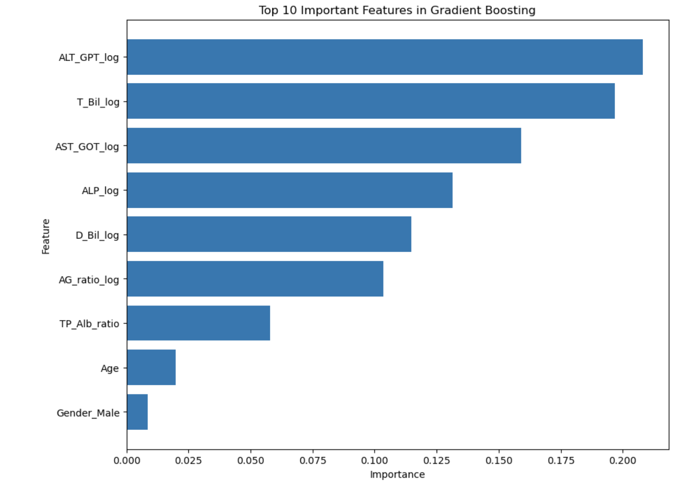
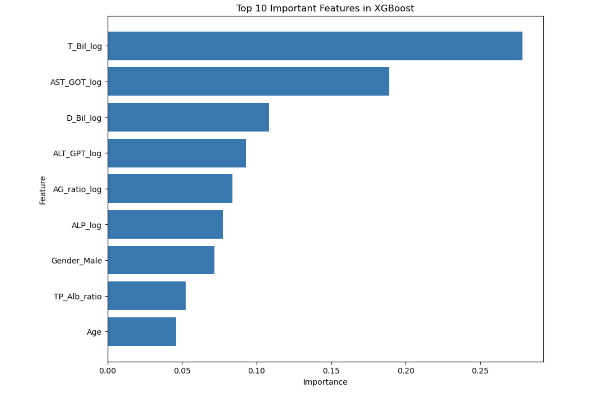
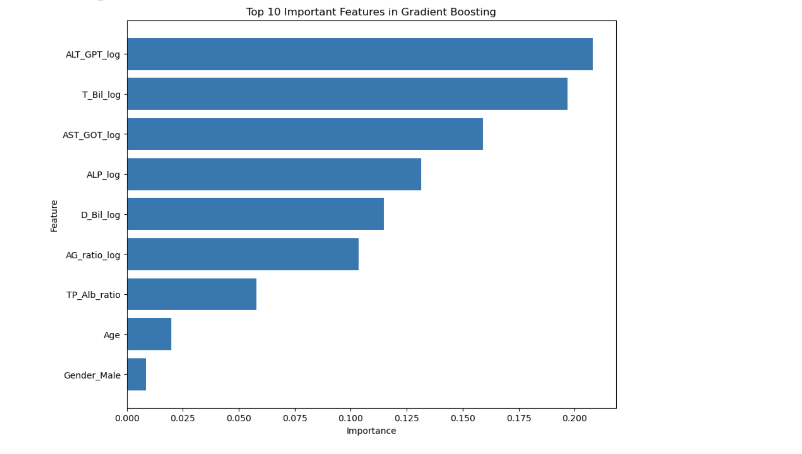
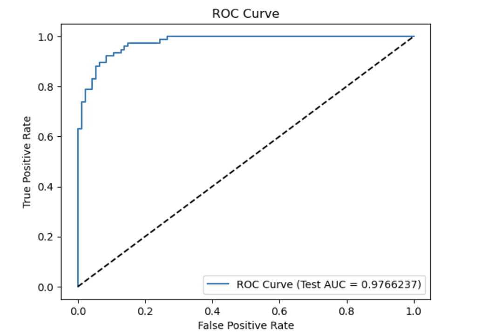

# **【第50回】Beginner限定コンペ〜肝疾患の確率を予測**

健康診断データを活用し、肝疾患の有無を判定するモデルを構築しました。本プロジェクトでは、評価指標AUC（Area Under the Curve）を用いて、複数の予測モデルを開発しました。

## **1. プロジェクト概要**

### **テーマ**
健康診断データに基づき、肝疾患の有無を判定するモデルの構築

### **背景**
肝疾患の早期発見は健康リスク軽減や医療費削減に直結します。本プロジェクトでは、検診データから肝疾患リスクを効率的に判定する予測モデルを開発し、医療現場のリスク管理の改善に貢献することを目的としました。

### **目的**
モデルの性能指標であるAUC（Area Under the Curve）を最大化し、肝疾患の有無を高精度で判定する分類モデルを構築すること。

### **成果**
- **最終AUCスコア**: 0.9238710（目標値 0.9212903 を達成）

## **2. データの概要**

### **データセット**
本プロジェクトで使用したデータは、健康診断結果を基に作成された多変量データであり、肝疾患の有無（目的変数）を予測することを目的としています。ただし、データセットはコンペ終了後に公開が停止されています。

### **データ形式**
- **行数**: 学習データ（train.csv）: **850**
- **列数**: 特徴量 **10個** + 目的変数 **1個**

### **特徴量の一覧**
以下は学習データに含まれる主要な特徴量とその概要です：

| 特徴量名         | 説明                                          | 型        |
|------------------|---------------------------------------------|-----------|
| `Age`           | 年齢                                         | 数値型    |
| `Gender`        | 性別（Male/Female）                         | カテゴリ型 |
| `T_Bil`         | 総ビリルビン値                              | 数値型    |
| `D_Bil`         | 直接ビリルビン値                            | 数値型    |
| `ALP`           | アルカリホスファターゼ値                    | 数値型    |
| `ALT_GPT`       | アラニンアミノトランスフェラーゼ値           | 数値型    |
| `AST_GOT`       | アスパラギン酸アミノトランスフェラーゼ値     | 数値型    |
| `TP`            | 総タンパク質値                              | 数値型    |
| `Alb`           | アルブミン値                                | 数値型    |
| `AG_ratio`      | アルブミン/グロブリン比                     | 数値型    |
| `disease`       | 肝疾患の有無（目的変数: 0=健康, 1=肝疾患） | 数値型    |

### **目的変数**
- **`disease`**
  - 値: `0`（健康）、`1`（肝疾患）
  - モデルの評価指数はAUC（Area Under the Curve）です。

### **欠損値**
trainデータ、testデータに欠損値は含まれていません。

---

## **3. 前処理の概要**

データの整合性を保ち、モデルの性能を最大限に引き出すために以下の前処理を実施しました。

### **3.1. 対数変換**
対象の特徴量に対し、値のスケールを調整し、外れ値の影響を軽減するために対数変換を適用しました。：
- `T_Bil`（総ビリルビン）
- `D_Bil`（直接ビリルビン）
- `ALP`（アルカリホスファターゼ）
- `ALT_GPT`（アラニンアミノトランスフェラーゼ）
- `AST_GOT`（アスパラギン酸アミノトランスフェラーゼ）
- `TP`（総タンパク質）
- `Alb`（アルブミン）
- `AG_ratio`（アルブミン/グロブリン比）

コード例:
```python
train_data['T_Bil_log'] = np.log1p(train_data['T_Bil'])
train_data['D_Bil_log'] = np.log1p(train_data['D_Bil'])
```

### **3.2. 外れ値のクリッピング**

一部の数値特徴量において、外れ値がモデルの性能に悪影響を与える可能性があったため、以下の手法で外れ値のクリッピングを試行しました。

#### **対象列**
- `AG_ratio`（アルブミン/グロブリン比）

#### **外れ値の検出方法**
- 四分位範囲（IQR）を使用して外れ値を定義。
  - 第1四分位数（Q1）
  - 第3四分位数（Q3）
  - IQR = Q3 - Q1
  - **外れ値の範囲**: [Q1 - 1.5 × IQR, Q3 + 1.5 × IQR] の外側

#### **手順**
1. **四分位範囲の計算**  
   - Q1（第1四分位数）: `AG_ratio`の下位25%の値
   - Q3（第3四分位数）: `AG_ratio`の上位75%の値
   - IQR = Q3 - Q1

2. **外れ値の検出**  
   - 下限値 = Q1 - 1.5 × IQR
   - 上限値 = Q3 + 1.5 × IQR
   - 範囲外のデータポイントを外れ値としてカウント。

3. **クリッピングの適用**  
   - `AG_ratio`の値を上下限値の範囲に収める（外れ値を範囲内に丸める）。

#### **結果**
- 外れ値の数（クリッピング前）: 192
- 外れ値の数（クリッピング後）: 0
- **図示**: クリッピング前後のデータ分布をヒストグラムで比較

#### **コード例**
```python
# AG_ratio列の四分位数を計算
Q1 = train_data['AG_ratio'].quantile(0.25)
Q3 = train_data['AG_ratio'].quantile(0.75)
IQR = Q3 - Q1

# 外れ値の範囲を計算
lower_bound = Q1 - 1.5 * IQR
upper_bound = Q3 + 1.5 * IQR

# 外れ値の検出
outliers = (train_data['AG_ratio'] < lower_bound) | (train_data['AG_ratio'] > upper_bound)

# クリッピングを適用
train_data['AG_ratio_clipped'] = train_data['AG_ratio'].clip(lower=lower_bound, upper=upper_bound)

```

#### **考察**

- クリッピングの適用により、外れ値を範囲内に収めることができました。
- しかし、最終モデルではクリッピングを適用せず、対数変換を採用した結果、モデル性能が向上しました。

---

### **3.3. 特徴量の相関関係確認**
対数変換後の特徴量選択
対数変換を適用した後、元の特徴量を削除し、データセットを簡潔化しました。以下の特徴量を残し、目的変数を含めて分析を進めました。

- `Age`
- `T_Bil_log`
- `D_Bil_log`
- `ALP_log`
- `ALT_GPT_log`
- `AST_GOT_log`
- `TP_log`
- `Alb_log`
- `AG_ratio_log`
- `disease`（目的変数）

#### **相関行列の可視化**

以下のヒートマップは、選択された数値特徴量間の相関を可視化したものです。高い相関を持つ特徴量ペアを確認でき、目的変数 `disease` との相関が強い特徴量に注目しています。



#### **考察**

- **高い相関を持つ特徴量のペア:**
  - `AST_GOT_log` と `ALT_GPT_log`（相関係数：0.70）
  - `Alb_log` と `TP_log`（相関係数：0.73）
  - `T_Bil_log` と `D_Bil_log`（相関係数：0.84）

- **目的変数 `disease` との相関が高い特徴量:**
  - `AST_GOT_log`（相関係数：0.50）
  - `T_Bil_log`（相関係数：0.47）

#### **結論**

- **冗長性の削減:** 高い相関を持つ特徴量（例：`AST_GOT_log` と `ALT_GPT_log`）は、モデルの単純化を考慮し、削減する余地があります。

- **重要特徴量の特定:** 目的変数との高い相関を持つ特徴量（例：`AST_GOT_log`, `T_Bil_log`）は、モデルの性能向上に寄与する可能性が高いため、注目すべきです。

---

### **4. 新しい特徴量の導入**

本プロジェクトでは、データの潜在的なパターンをよりよく捉え、予測精度を向上させるために、以下の新しい特徴量を作成しました。

#### **年齢のカテゴリ分け**

- **目的**: 年齢層に応じた肝疾患のリスク変動を捉える。
- **方法**: 年齢を5つのカテゴリに分ける。各カテゴリは生理的変化や肝機能への影響を異にするため。
- **コード**:
  ```python
  train_data['Age_bucket'] = pd.cut(train_data['Age'], bins=[0, 20, 40, 60, 80, 100], labels=[1, 2, 3, 4, 5])

  ```
#### **グロブリン値の計算**

- **目的**: タンパク質代謝の異常を示すグロブリン値を把握する。
- **方法**: 総タンパク質（TP_log）からアルブミン（Alb_log）を引いた値をグロブリン値として計算。
- **コード**:
  ```python
  train_data['Globulin'] = train_data['TP_log'] - train_data['Alb_log']

  ```

#### **仮定的な肝機能スコア**

- **目的**: 複数の肝機能指標を組み合わせて、総合的な肝機能スコアを作成。
- **方法**: AST、ビリルビン、アルブミンのログ変換値を組み合わせ。
- **コード**:

```python
train_data['Liver_Function_Combined_Score'] = (
  train_data['AST_GOT_log'] +
  train_data['T_Bil_log'] -
  train_data['Alb_log']
)
 ```

#### **タンパク質とアルブミンの比**

- **目的**: タンパク質とアルブミンのバランスを評価するための新しい指標を導入。
- **方法**: 二つの数値の比率を計算して新しい特徴量として追加。
- **コード**:
  ```python
  train_data['TP_Alb_ratio'] = train_data['TP_log'] / (train_data['Alb_log'] + 1e-8)  # 0除算を避けるために微小値を加える
 
---

### **5. カテゴリ変数の処理**

データセット内のカテゴリ変数を処理するため、ワンホットエンコーディングを適用しました。これにより、カテゴリ変数を数値化し、機械学習モデルが扱いやすい形式に変換します。

#### **対象のカテゴリ変数**

- `Gender`（性別）

#### **エンコーディングの手順**
1. **OneHotEncoderの設定**: `sparse_output=False`を指定して密な配列を出力し、`handle_unknown='ignore'`で未知のカテゴリに対応。
2. **カテゴリ変数のエンコード**: `Gender`列をエンコーディングして新たな特徴量を作成。
3. **エンコード結果の統合**: エンコードされた特徴量を元のデータフレームに統合。

#### **コード例**
```python
from sklearn.preprocessing import OneHotEncoder
import pandas as pd

# ワンホットエンコーディングを適用するカテゴリ変数
categorical_columns = ['Gender']

# OneHotEncoderのインスタンスを作成
encoder = OneHotEncoder(sparse_output=False, handle_unknown='ignore')

# カテゴリ変数をエンコード
encoded_columns = encoder.fit_transform(train_data[categorical_columns])

# エンコードされた列の名前を取得
encoded_col_names = encoder.get_feature_names_out(categorical_columns)

# エンコードされた列をデータフレームに変換
encoded_df = pd.DataFrame(encoded_columns, columns=encoded_col_names, index=train_data.index)

# オリジナルのデータフレームからカテゴリ変数を削除し、エンコードされた列を追加
train_data = train_data.drop(categorical_columns, axis=1)
train_data = pd.concat([train_data, encoded_df], axis=1)

  ```

### **6. 特徴量選択の最終確認**

#### **相関行列の再確認**
特徴量間及び目的変数との相関を再度確認し、以下の相関行列を用いて評価しました。このステップでは、特に高い相関を持つ特徴量を削除することに焦点を当てました。



#### **削除した特徴量**
以下の特徴量を削除:
- `AST_GOT_log` と `ALT_GPT_log` の間の相関が0.70以上と高かったため、一方を削除しました。
- `TP_log` と `Alb_log` の積、`TP_Alb_interaction` が目的変数 `disease` と弱い相関を示したため、削除しました。

#### **保持した特徴量**
- `T_Bil_log`と`D_Bil_log` は非常に高い相関（0.84）を示しますが、これらは肝機能評価において重要な指標であるため、両方とも保持しました。

#### **結論**
削減された特徴量により、モデルの単純化を図りつつ、重要な情報を保持する試みを行いました。この過程で、過学習のリスクを軽減し、モデルの一般化能力が向上することを目指しました。ただし、相関性が高い特徴量でも削除しない方が良い結果になるケースが存在するため、特徴量を削除する前後でモデルの性能変化を詳細に評価しました。

#### **継続する特徴量**
最終的なモデルで使用される特徴量は以下の通りです:
- `Age`
- `T_Bil_log`
- `D_Bil_log`
- `ALP_log`
- `ALT_GPT_log`
- `Alb_log`
- `AG_ratio_log`
- `Gender_Male`
- `TP_Alb_ratio`
- `disease` （目的変数）

---

### **7. データのスケーリング**

- **目的**: 特徴量のスケールを調整し、モデルの収束速度を向上させ、異常値の影響を軽減。
- **試行した手法**:
  - RobustScaler: 四分位範囲に基づいてスケールを調整し、外れ値の影響を軽減。
  - StandardScaler: 特徴量を平均0、分散1に正規化。
- **結果**: 両スケーリング方法を試した結果、スコアに大きな差は見られませんでした。

#### **コード例**

```python
from sklearn.preprocessing import RobustScaler, StandardScaler
import joblib

# disease列をスケーリング対象から除外
y_train = train_data['disease']
X_train = train_data.drop(columns=['disease'])

# RobustScalerの適用
robust_scaler = RobustScaler()
X_train_scaled_robust = robust_scaler.fit_transform(X_train)

# スケーラーの保存
joblib.dump(robust_scaler, 'robust_scaler.pkl')

# StandardScalerの適用
standard_scaler = StandardScaler()
X_train_scaled_standard = standard_scaler.fit_transform(X_train)

# スケーラーの保存
joblib.dump(standard_scaler, 'standard_scaler.pkl')

```
---

### **8. 主成分分析 (PCA) の適用**

- **目的**: 特徴量の次元を削減し、モデルの過学習を防ぎつつ、重要な情報を保持。
- **方法**: PCAを適用し、累積分散比が90%を超える3つの主成分を選択。
- **手順**: 
  - ターゲット変数（disease）を分離
  - ターゲット変数をスケーリングや変換の影響を受けないように除外
  - PCAの適用
  - 主成分の数を3に指定
  - 累積分散比を計算し、90%以上の情報を保持する主成分を選択
  - データの再結合
  - PCA後の主成分データフレームとターゲット変数を結合
- **結果**:
  - 累積分散比: [0.59131607, 0.85282445, 0.90188557]
  - 主成分1～3で90%以上の分散を保持。

#### **考察**
PCAの適用により、次元削減を実現しつつ、情報の大部分を保持しました。
累積分散比が90%を超える3つの主成分を選択することで、モデルの計算負荷を軽減する効果が期待されます。
ただし、PCAは特徴量の物理的な意味を失う可能性があるため、モデルの解釈性が重要な場合には注意が必要です。

---

### **9. モデルのトレーニング**

- **使用モデル**: 
  - Gradient Boosting
  - XGBoost
  - LightGBM

#### **Gradient Boostingモデルの特徴量重要度**

以下のグラフは、Gradient Boostingモデルによる特徴量の重要度を可視化したものです。



- **上位の重要な特徴量**: 
  - ALT_GPT_log
  - T_Bil_log
  - AST_GOT_log

#### **考察**
上位3つの特徴量:

ALT_GPT_log、T_Bil_log、およびAST_GOT_logが肝疾患の有無を予測する上で重要であることが分かりました。
特に、ALT_GPT_logの重要度が高く、モデルの予測精度に大きな影響を与えています。

他の特徴量:

ALP_logやD_Bil_logも一定の重要度を持ちますが、上位3つに比べるとやや劣ります。
AgeやGender_Maleの影響は限定的でしたが、モデルのバランスを保つために含めています。

#### **XGBoostingモデルの特徴量重要度**

以下のグラフは、XGBoostモデルによる特徴量の重要度を可視化したものです。



- **上位の重要な特徴量**: 
 - T_Bil_log
 - AST_GOT_log
 - D_Bil_log

#### **考察**
上位3つの特徴量:

T_Bil_log（総ビリルビン）はXGBoostモデルで最も重要とされる特徴量です。
次に重要な特徴量として、AST_GOT_logとD_Bil_logが続き、肝疾患との関連が強い可能性を示しています。

その他の特徴量:

ALT_GPT_logやAG_ratio_logも一定の重要度を持ちますが、上位3つには劣ります。
Gender_MaleやAgeの重要度は比較的低いですが、全体的なモデル性能に貢献しています。


## 【アプローチ】 
データの前処理ではそれぞれの特徴量に対数変換を適用しています。
モデルのトレーニングに使用したアリゴリズム
- Random Forest
- GradientBoost
- XGBoost
- CatBoost
- LightGBM
- SVM
- Logistic Regression

ベースにGradientBoost、XGBoost、LightBGMを使用し、メタにLogistic Regressionを使用したスタッキングアンサンブルを作成しました。


## 【モデルが重視する特徴量】
特徴量はモデルが重視する特徴量を確認し、選定しました。



## 【クロスバリデーションを設定しグリッドサーチを実行】
StratifiedKFoldを設定しGridSearchとRandomSearchを試してみました。
グリッドサーチは少し時間がかかりますが、ランダムサーチと比べると比較的高いスコアが出ました。

## [モデルの精度を可視化する】
### Mean Cross-Validation AUC: 0.9303941785588647
### Test AUC: 0.9766237402015677



## 【成果と学び】
Mean Cross-Validation AUCとTest AUCの間に大きな開きが見られました。
パラメータをチューニングして調整しましたが、さらなる調整が必要です。
今後は、探索的データ分析を強化し、より高度なハイパーパラメータチューニングや異なるタイプのクロスバリデーションを使用して、
モデルの検証を行いたいと思います。
